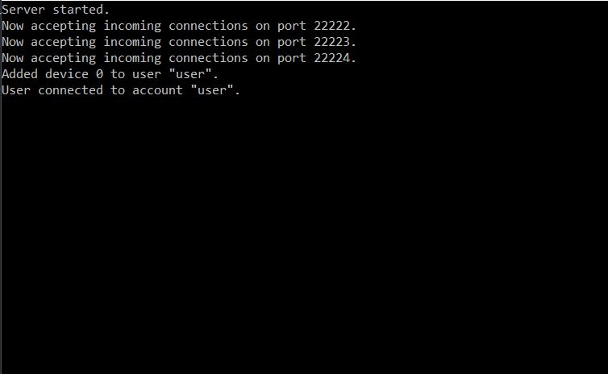

<p align="center">

</p>

<p align="center">XS Remote is an open source, fullstack, client-server-app with a simple [HTTPS website](https://xsware.at).</p>  

<p align="center">

</p>  
  
<p align="center">The app allows you to remote control your PC with your Smartphone. Adjust the volume, switch the song or shut it down from the couch!</p>  

<p align="center">

</p>    

<p align="center">The project features a fully multithreaded server with elliptic curve key exchange, AES encrypted connections, a hashed and salted account data base and a spam filter.</p>
<p align="center">

</p>  


## Server commands:
```
account adduser <username> <password>  
account addadmin <username> <password>  
account remove <username>  
account changepw <username> <old password> <new password>  
```

## Client commands:
```
control shutdown <minutes>  
control restart <minutes>  
control abort  

volume up
volume down
volume mute

media play
media previous
media next
```
